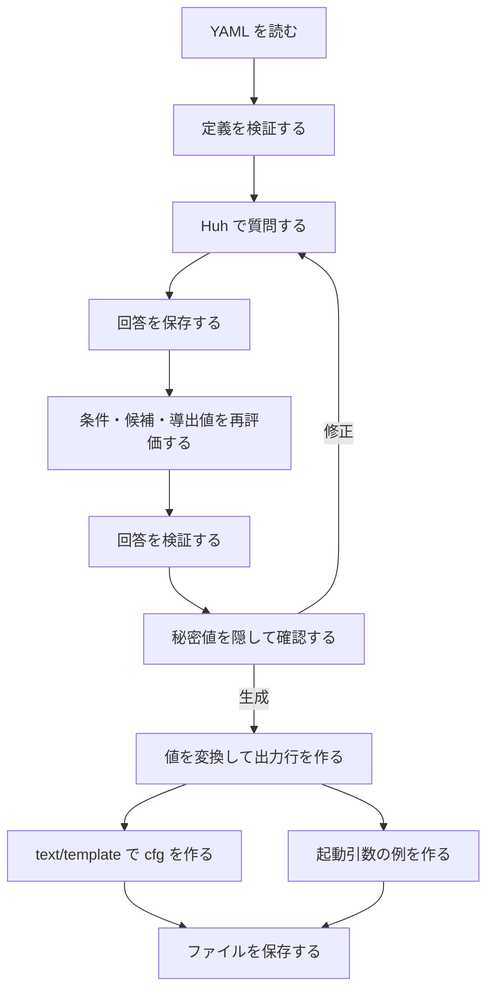

# Debian Preseed Generator 実装課題

Go の基礎を学びながら、Huh に回答すると Debian 13 系の Preseed ファイルができるアプリを作るための課題です。
番号順に進めます。最初は一つの入力欄から始め、最後に既存 YAML 全体を扱う TUI と、実際のインストールで確かめる手順まで完成させます。

この文書は実装前の設計と課題です。ここに示すファイル・関数は、これから自分で作るものです。
完成コードを一度に貼り付ける教材ではなく、「何を作るか」「何を調べるか」「どう動けば合格か」を示します。

## 現在地

確認したファイルは [ARCHITECTURE.md](../ARCHITECTURE.md)、[main.go](../main.go)、[go.mod](../go.mod)、[BasePreseed.YAML](../BasePreseed.YAML)、[Huh 入門](huh-guide.md) です。

| ファイル | 現在の状態 | この課題での扱い |
| --- | --- | --- |
| `main.go` | Huh の単一選択を一つ実行する試作 | まずここから少しずつ変更する |
| `BasePreseed.YAML` | 11 グループ・67 設定・9 catalog を持つ設計案 | 小さい学習用 YAML を経て、最終的に全体を使う |
| `ARCHITECTURE.md` | 利用予定のパッケージの一覧 | 設計を実装した時点で、実際の構成も追記する |
| `docs/huh-guide.md` | このプロジェクトの Huh v2 の入門 | 操作・API を調べる最初の資料にする |

`go.mod` の Huh は `charm.land/huh/v2 v2.0.3`、YAML は `go.yaml.in/yaml/v4 v4.0.0-rc.6` です。
教材ではこのバージョンを基準にします。別バージョンの記事の import や API をそのまま混ぜないでください。
YAML v4 はこのリポジトリでは RC 版を使っているため、API は手元の版のドキュメントでも確認します。

既存 YAML には Debian `13.5` のメディア名や検証状況が記載されています。
これらは今回その ISO を使ってインストールできると確認した結果ではありません。
対象メディアを実際に用意する課題24で、版・収録データ・動作を照合します。

## 最初に決める設計

### アプリが担当する範囲

最終的には次の流れを実現します。

1. 組込み YAML、またはユーザーが指定した YAML を読む。
2. 定義の間違いを検出し、問題がある場合は質問を開始しない。
3. カテゴリごとに質問し、回答に応じて必要な質問だけを表示する。
4. 入力値と、回答どうしの組合せを検証する。
5. 秘密値を隠した確認画面を表示し、必要なら回答を修正する。
6. パスワードなどを変換し、Preseed の行を組み立てる。
7. `preseed.cfg` と、読み込み方法に合う起動引数の例を保存する。

生成アプリはインストーラーを起動せず、実行した PC のディスクを操作しません。
ディスク名や NIC 名は、**これから Debian を入れる側のマシン**の情報として質問します。
ISO の再作成、配布サーバーの構築、暗号化・RAID・IPv6 UI などは、既存 YAML の `scope.deferred` に従って今回の完成範囲から外します。

### 三つのデータを分ける

| データ | 内容 | 例 |
| --- | --- | --- |
| 質問定義 `Definition` | 何を聞くか、候補、条件、どのキーへ出力するか | `hostname` は文字列入力、`netcfg/hostname` へ出力 |
| 回答 `Answers` | 今回ユーザーが選んだ値 | `hostname = debian-server` |
| 出力行 `Entry` | Preseed に書く owner・key・type・value | `d-i netcfg/hostname string debian-server` |

YAML の `label` は画面に表示する名前、`value` は保存・出力する値です。
「日本語」という表示文字列を Preseed の言語コードとして出力してはいけません。

Preseed はこのアプリ用の YAML とは別形式で、基本形は `owner key type value`、先頭は `#_preseed_V1` です。
型と値の間の空白にも意味があります。生成方法は [Debian のファイル作成ガイド](https://www.debian.org/releases/trixie/amd64/apbs03.en.html) に合わせます。

### 処理の担当を分ける



Huh は入力欄や選択欄を表示する役です。YAML の解釈、条件の判定、Preseed への変換は Go 側で実装します。
まずは `Form.Run()` を使う構成にし、Bubble Tea のイベント処理を自作する段階は設けません。
この使い方は [Huh v2.0.3 の README](https://github.com/charmbracelet/huh/tree/v2.0.3) と [API](https://pkg.go.dev/charm.land/huh/v2@v2.0.3) を参照します。

### 最終的なファイル構成

最初からこの構成を全部作る必要はありません。課題7で処理を分け、課題に合わせてファイルを追加します。
`internal` は、このプロジェクト内部で使うパッケージを置くディレクトリです。

```text
main.go                         起動・フラグ・終了コード
assets.go                       YAML とテンプレートの埋込み
BasePreseed.YAML                 標準の質問定義
templates/preseed.tmpl           cfg の見た目だけを定義
internal/
  model/                        Definition、Setting、Answer、Entry
  definition/                   YAML 読込み、定義の検証
  engine/                       条件・候補・導出・変換・出力行の構築
  validation/                   入力値と回答の組合せの検証
  tui/                          質問・確認・修正の画面
  preseed/                      text/template による cfg 生成
  bootargs/                     読込み用の起動引数生成
  output/                       ファイル保存
testdata/                       学習用 YAML、異常系、期待する cfg
docs/
  huh-guide.md
  implementation-exercises.md   この文書
  usage.md                      最後に作る利用手順
  verification.md               最後に作る実機相当の検証記録
```

`model` は Huh や YAML 読込み処理を import しません。
ただし YAML と対応する構造体には、読込み用の `yaml:"..."` タグを付けます。
`engine` は Huh を import せず、引数から結果またはエラーを返します。
`tui` は `engine` と `validation` を呼び出します。生成や保存の関数から TUI を呼ぶことはありません。
これにより、端末操作をせず生成ロジックをテストできます。

### 設計上の約束

| 論点 | 採用する方針 |
| --- | --- |
| 回答の型 | 文字列・真偽値・文字列のスライスを区別する |
| 未回答 | map に ID が存在しない状態。`false`、空文字列、空スライスは回答として保持できる |
| 初期値と固定値 | `default` は変更できる初期値、`value` は質問しない固定値 |
| 未指定と空値 | YAML でも区別する。`value: ''` を未指定として扱わない |
| 質問順 | YAML の配列順。依存先は先に解決できる定義にする |
| 出力順 | `settings` と各 `preseed` の配列順。map の巡回順には依存しない |
| 条件 | 有効・無効・まだ判定できない、を区別する。未回答を勝手に `false` にしない |
| 再編集 | 関係する回答・候補・導出値を再評価する。無効な古い回答は出力しない |
| 専用処理 | YAML 内の名前を Go の登録済み関数へ対応させる。任意の Go 式やシェル式は評価しない |
| 検証 | 定義読込み時、回答時、生成前の三段階で行う |
| 秘密値 | パスワード、認証付き URL、プロキシ情報、独自コマンドを確認画面・ログへそのまま出さない |
| 保存 | 最初は上書き禁止。最後に明示確認付きの上書きと途中失敗への対処を追加する |
| 完成の判定 | Go のテスト、cfg の構文検査、VM でのインストールを別々に確かめる |

パスワード入力には Huh の `EchoMode` を使います。
Huh と `golang.org/x/term` の非表示入力を同時に使う必要はありません。
`x/term` を使うなら、後半の端末判定など、別の目的がある時だけ使います。

## 進め方と到達点

| 課題 | 到達点 |
| --- | --- |
| 1〜3 | 入力、構造体、検証を理解する |
| 4〜6 | 小さな cfg を回答から生成・保存する |
| 7〜10 | 処理を分離し、小さい YAML から質問する |
| 11〜13 | 条件・専用処理・候補の変化を扱う |
| 14〜18 | Debian 向けの各カテゴリを実装する |
| 19〜21 | 全 YAML、回答修正、読み込み用の起動引数に対応する |
| 22〜24 | 配布できる構成にして、実際のインストールで検証する |

**課題6までの cfg は学習用の断片です。無人インストールを完了させる設定ではありません。**
「文字列が出た」と「Debian をインストールできた」は、別の到達点として扱います。

各課題では、まず「学ぶこと」を調べ、手順を一つずつ実装し、完了条件を確認します。
一つの課題を一度で終える必要はありません。課題14以降は、小項目一つを一回の作業にして構いません。
動いたコードを小さくコミットしておくと、次の課題で戻りやすくなります。秘密値や生成した本番 cfg はコミットしません。
コマンドはリポジトリのルートで実行します。複数の Go ファイルを作るため、起動には `go run .` を使います。
`go run main.go` では、その隣に作った `answers.go` などが一緒にコンパイルされません。

### 用語の最初の説明

| 用語 | この課題での意味 |
| --- | --- |
| 構造体 `struct` | 関連する値に名前を付けてまとめた型 |
| ポインター `&x` | 変数 `x` を更新するために、その場所を渡すもの |
| スライス `[]string` | 文字列を複数個、順番付きで持つもの |
| map | ID などのキーから値を探すもの |
| `error` / `nil` | 処理失敗の情報／エラーがない状態 |
| スキーマ | YAML の項目名・型・組合せについての約束 |
| resolver | 回答や catalog から候補・初期値・導出値を計算する関数 |
| transform | 決まった値を出力用へ変換する関数 |
| fixture | テストや学習に使う小さな入力データ |
| 単体テスト | 小さな関数の結果をプログラムで確かめるもの |
| 結合テスト | 読込みから生成など、複数の処理をつないで確かめるもの |

## 課題1：一つの質問を最後まで動かす

**目標：** 選択に成功した場合と、ユーザーが中断した場合を分けられるようにする。

**学ぶこと：** `package`、`import`、変数、`if`、関数呼出し、`error`、`return`、標準出力と標準エラー。

**作業する場所：** `main.go`。

1. 今のコードを `go run .` で動かし、選択結果を確認する。
2. `test_var` を意味の分かる名前にする。Go の変数名は、例えば `selectedLanguage` のように書く。
3. 選択肢を「日本語 → `ja`」「English → `en`」に変更する。
4. `form.Run()` のエラーがあれば、結果を表示せずに終了する。
5. `errors.Is(err, huh.ErrUserAborted)` で中断を区別し、「入力を中断しました」と表示する。
6. 通常のエラーは `os.Stderr` に出す。終了コードの整理は課題23で行う。

**完了条件：**

- [ ] 日本語を選ぶと `ja` が表示される。
- [ ] `Ctrl+C` で途中の回答や空の結果を表示しない。
- [ ] `&selectedLanguage` を渡す理由を、自分の言葉で説明できる。

**調べる入口：** [Huh 入門の基本構造](huh-guide.md#基本の構造)、[Go の変数](https://go.dev/tour/basics/8)、`go doc errors.Is`。

**つまずいたら：** エラーを表示した後にも処理が続いていないか、`return` の位置を確認する。

## 課題2：回答を構造体にまとめる

**目標：** 複数の回答を、一つのまとまりとして扱う。

**学ぶこと：** `struct`、フィールド、初期値、`bool`、`[]string`、構造体のフィールドへのポインター。

**作業する場所：** `main.go`、新しい `answers.go`。両方とも、この段階では `package main`。

1. `Answers` 構造体を作り、`Language string`、`Hostname string`、`UseMirror bool`、`Tasks []string` を持たせる。
2. `main` で `answers` を作り、ホスト名の初期値を `debian-server` にする。
3. Huh の `Select`、`Input`、`Confirm`、`MultiSelect` をそれぞれ一つ作る。
4. `Value(&answers.Hostname)` のように、構造体のフィールドへ回答を書き込む。
5. タスク候補は `standard` と `ssh-server` の二つから始める。
6. 完了後に回答を表示する。まだ秘密値は入力しない。

**完了条件：**

- [ ] ホスト名を書き換えると、構造体にその値が残る。
- [ ] 複数選択を二つ選ぶと、スライスに二つの値が入る。
- [ ] `UseMirror` に「いいえ」を選び、`false` が正常な回答になることを確認できる。

**調べる入口：** [Go の構造体](https://go.dev/tour/moretypes/2)、[スライス](https://go.dev/tour/moretypes/7)、[Huh のサンプル](huh-guide.md#動かせるサンプル)。

**つまずいたら：** フィールド名、型、`Value()` が要求するポインターの型を順に確認する。

## 課題3：入力検証を関数にする

**目標：** 間違ったホスト名を入力欄で止め、生成前にも同じ検証を使えるようにする。

**学ぶこと：** 関数の引数・戻り値、`string`、`len`、`strings`、`errors.New`、検証ルール。

**作業する場所：** 新しい `validation.go`、`main.go`。

1. `func validateHostname(s string) error` を作る。
2. このアプリのルールを「ASCII の英数字と `-`、1〜63文字、先頭末尾は英数字」と決める。
3. 空文字列、空白、`a.b`、先頭の `-`、改行・CR・NUL を拒否する。
4. Huh の `Validate(validateHostname)` に関数を渡す。
5. フォーム完了後にも呼び、正常な回答だけが次へ進めるようにする。

**完了条件：**

- [ ] `debian-server`、`node01` は通る。
- [ ] 空欄、`-server`、`server-`、`a.b` は直す理由を表示する。
- [ ] 入力欄を経由せず関数を直接呼んでも、不正な値を拒否する。

**調べる入口：** `go doc strings`、`go doc errors.New`、[Huh の入力検証](huh-guide.md#入力検証)。

**考える問題：** なぜ、入力欄で検証済みでも生成前の検証が必要になるのか。

## 課題4：回答を Preseed の行へ変換する

**目標：** 回答と出力形式を切り離す。

**学ぶこと：** 別の構造体、スライスへの `append`、`for`、`strconv.FormatBool`、`strings.Join`。

**作業する場所：** 新しい `preseed.go`。まだ `package main` でよい。

1. `Entry` 構造体に `Owner`、`Key`、`Type`、`Value` をすべて `string` で定義する。
2. `func buildEntries(a Answers) ([]Entry, error)` を作る。
3. 言語、ホスト名、ミラー使用、タスクをそれぞれ出力行へ変換する。
4. ホスト名は `netcfg/get_hostname` と `netcfg/hostname` の二行にする。
5. boolean は `true` / `false`、タスクは `", "` で連結する。
6. タスクの owner は `tasksel`、キーは `tasksel/first` とする。全行を `d-i` に固定しない。

この段階の出力例：

```text
d-i debian-installer/language string ja
d-i netcfg/get_hostname string debian-server
d-i netcfg/hostname string debian-server
d-i apt-setup/use_mirror boolean true
tasksel tasksel/first multiselect standard, ssh-server
```

キー・owner・型の確認には、[Debian 公式のサンプル](https://www.debian.org/releases/trixie/example-preseed.txt) を使います。
この例だけではインストールは完了しません。

**完了条件：**

- [ ] `buildEntries` の中に Huh や `fmt.Println` がない。
- [ ] ミラーを使わない回答も、行を消さず `boolean false` に変換される。
- [ ] タスクの表示名を変更しても、出力値は変わらない。

**つまずいたら：** `fmt.Sprint` でスライスをそのまま出力せず、区切り文字を明示する。

## 課題5：text/template で cfg を作る

**目標：** 出力行から、ヘッダー付きの cfg 全体を作る。

**学ぶこと：** `text/template`、`bytes.Buffer`、テンプレートの `range`、処理と表示形式の分離。

**作業する場所：** `preseed.go`、新しい `templates/preseed.tmpl`。

1. 先頭に `#_preseed_V1` を書くテンプレートを作る。
2. `[]Entry` を巡回して、一行ずつ `Owner Key Type Value` を出力する。
3. `func renderPreseed(entries []Entry) ([]byte, error)` を作る。
4. `Parse` と `Execute` の両方のエラーを返す。
5. `Value` が空の行でも、ヘッダーや改行が壊れないことを確認する。
6. 変換や条件分岐はテンプレートに追加せず、課題4の行構築側で行う。

**完了条件：**

- [ ] 同じ入力行から、毎回同じ並び・同じ内容が生成される。
- [ ] ヘッダーが一回だけ出て、最後に改行がある。
- [ ] 型と値の間に、意図しない複数の空白が入らない。
- [ ] パスワードや boolean の処理をテンプレートへ書いていない。

**調べる入口：** `go doc text/template`、`go doc bytes.Buffer`、[Preseed の書式](https://www.debian.org/releases/trixie/amd64/apbs03.en.html)。

**つまずいたら：** `{{-` や `-}}` による空白除去は、最初は使わない。行がくっつく原因になる。

## 課題6：確認してから学習用 cfg を保存する

**目標：** 最初の「回答 → 生成 → 保存」を完成させる。

**学ぶこと：** `os.OpenFile`、ファイルの `Write` / `Close`、ファイル権限、保存の確認。

**作業する場所：** `main.go`、新しい `output.go`。

1. 回答後に、今回の設定を読みやすく表示する。
2. 「この内容で保存しますか？」を Huh の `Confirm` で質問する。既定は保存しない側にする。
3. 保存先を一旦 `preseed.cfg` に固定する。
4. `os.O_WRONLY | os.O_CREATE | os.O_EXCL` と権限 `0600` で開く。
5. `Write` と `Close` のエラーを確認する。失敗を成功として表示しない。
6. `O_EXCL` で既存ファイルがある場合は、上書きせず理由を表示する。

**完了条件：**

- [ ] 保存を断ると、新しいファイルを作らない。
- [ ] 最初の保存は成功し、二回目は既存ファイルを変更しない。
- [ ] `Ctrl+C` の後に保存処理へ進まない。
- [ ] 保存に成功した場合だけ保存先を表示する。

**調べる入口：** `go doc os.OpenFile`、`go doc os.File.Write`、`go doc os.File.Close`。

**ここでの到達点：** 学習用の cfg 断片を生成できた。ここまで動いたら、次へ進む前にコードを読み返す。

## 課題7：パッケージに分け、最初のテストを書く

**目標：** 入力画面を開かずに、検証と生成を確かめられる構成にする。

**学ぶこと：** パッケージ、import、公開名、`*_test.go`、`testing.T`、期待値、`t.TempDir()`。

**作業する場所：** `internal/model`、`internal/validation`、`internal/preseed`、`internal/output`、`internal/tui`、`internal/engine`。

1. `Answers` と `Entry` を `model` へ移す。
2. `validateHostname` を `validation.ValidateHostname` にし、`validation` へ移す。
3. 行構築を `engine.BuildEntries`、描画を `preseed.Render`、保存を `output` へ移す。
4. Huh を使う質問処理を `tui` に移し、`main` は呼出し順の管理にする。
5. まずホスト名の正常・異常各一件のテストを書き、`go test ./...` で動かす。
6. 行構築の boolean・タスク・ホスト名二行をテストする。
7. 保存のテストに `t.TempDir()` を使い、同名ファイルを変更しないことを確かめる。

公開する名前は大文字で始めます。import パスの先頭は、このリポジトリの `go.mod` にある `github.com/RyutaC2/debian-preseed-generator` です。

**完了条件：**

- [ ] `go run .` の動作を維持できる。
- [ ] `go test ./...` で画面が開かず、テストが終わる。
- [ ] import の循環がない。
- [ ] テスト用の保存が普段の `preseed.cfg` を変更しない。

**調べる入口：** [Go のテスト入門](https://go.dev/doc/tutorial/add-a-test)、`go doc testing`。

**つまずいたら：** 全関数を一度に移さず、「型 → 検証 → 生成 → 保存 → 画面」の順で移す。

## 課題8：小さい YAML を構造体へ読む

**目標：** コードに書いていた質問情報を YAML から読み取る。

**学ぶこと：** YAML の配列と map、構造体タグ、デコード、未指定と空値、ファイル読込み。

**作業する場所：** `testdata/minimal.yaml`、`internal/model/definition.go`、`internal/definition/load.go`。

1. `schema_version`、`groups`、`settings` だけを持つ学習用 YAML を作る。
2. 設定は `language`、`hostname`、`use_mirror`、`tasks` の四つにする。課題2の値に対応させる。
3. `groups` は「基本設定」の一グループ。選択肢は `answer.choices` に直接書く。
4. 各設定の `preseed` に owner・key・type・`value_from` を書く。
5. `Definition`、`Group`、`Setting`、`AnswerSpec`、`PreseedSpec`、`Choice` を定義する。
6. `default` など複数の型を取り得る値は `yaml.Node` で読み、文字列・bool・文字列配列へ変換する小さな関数を作る。
7. `Load(data []byte) (model.Definition, error)` を作り、結果の件数だけ表示して確認する。

学習用の一項目の形は、既存 YAML と揃えます。

```yaml
schema_version: 1
groups:
  - id: basic
    label: 基本設定
settings:
  - id: hostname
    group: basic
    label: ホスト名
    answer:
      kind: input
      default: debian-server
    preseed:
      - owner: d-i
        key: netcfg/hostname
        type: string
        value_from: hostname
```

これは一項目の例です。四項目の fixture は、自分で追加します。
`yaml.Node` の未指定と `!!null` は区別し、回答の `default: null` はこの設計では拒否します。
catalog の `default_country: null` など、メタデータとして許される null は別の規則で扱います。

**完了条件：**

- [ ] YAML を読むだけのテストが動く。
- [ ] `default: false`、`default: ''`、`default: []` を、未指定と区別できる。
- [ ] YAML の構文エラーを返せる。
- [ ] 既存の巨大な YAML を、この小さな型へ無理に読み込ませていない。

**調べる入口：** `go doc go.yaml.in/yaml/v4.Node`、`go doc go.yaml.in/yaml/v4.Decoder`、[YAML ライブラリの API](https://pkg.go.dev/go.yaml.in/yaml/v4)。

**つまずいたら：** 読込み用の YAML 型と、実行中の回答の型を混同しない。YAML で曖昧な値は、読込みの境界で型を確定させる。

## 課題9：間違った質問定義を読み込み時に止める

**目標：** 壊れた YAML のまま TUI が始まらないようにする。

**学ぶこと：** map を使った重複検出、参照チェック、厳密なデコード、分かりやすいエラー。

**作業する場所：** `internal/definition/validate.go`、`testdata/invalid/`。

1. `schema_version: 1` だけを受け付ける。
2. `Decoder.KnownFields(true)` で未知のフィールド名を拒否する。
3. 空の ID、重複する group ID・setting ID、存在しない group への所属を拒否する。
4. 現段階の `kind` は `input`、`select`、`boolean`、`multiselect` だけ登録する。
5. 選択肢の値の重複、選択肢にない初期値、型の合わない初期値を拒否する。
6. `preseed.value_from` の参照先、owner・key・type の形式を確認する。
7. 二つ目の YAML 文書があれば拒否する。最初の文書だけを黙って採用しない。
8. エラーに設定 ID と項目の場所を含める。例：`hostname.answer.default: 文字列が必要です`。

**完了条件：**

- [ ] `label` を `lable` にするとエラーになる。
- [ ] ID 重複、参照先不存在、不明な `kind` のテストがある。
- [ ] 不正定義の場合、入力画面も出力ファイルも作らない。
- [ ] `false` や空の初期値を、存在しない値として判定しない。

**調べる入口：** `go doc go.yaml.in/yaml/v4.Decoder.KnownFields`、[Go の map](https://go.dev/tour/moretypes/19)。

**注意：** この課題の型で受け付けるのは学習用 YAML です。未実装の機能を含む全 YAML の扱いは課題19で整えます。

## 課題10：YAML の定義から Huh の質問を作る

**目標：** 質問名や選択肢を YAML で変更できるようにする。

**学ぶこと：** `switch`、回答の型を表す定数、map の存在確認、ローカル変数とポインター。

**作業する場所：** `internal/model/answer.go`、`internal/tui/questions.go`、`internal/engine/entries.go`。

1. 課題2の固定 `Answers` を、`map[string]Answer` を持つ回答ストアへ置き換える。
2. `Answer` に種別と、文字列・bool・文字列スライスの値を持たせる。型違いの読取りはエラーにする。
3. `GetString(id)`、`GetBool(id)`、`GetStrings(id)` などを作る。未回答と型違いを区別する。
4. `kind` ごとに `Input`、`Select[string]`、`Confirm`、`MultiSelect[string]` を作る。
5. 回答先はローカル変数にし、質問が正常完了したら回答ストアへ書き戻す。
6. まず一問ずつ `Run()` する。カテゴリ名を表示し、条件処理を追加できる形にする。
7. 行構築を YAML の `preseed` に基づく処理へ置き換える。

map の値に直接 `&answers[id]` は使えません。map にある回答をローカル変数へ取り出し、その変数のポインターを Huh へ渡します。
同じ型のゼロ値でも、「map にキーがない」と「キーがあり値が `false`」は別です。
スライスをコピーして保持する場合は、編集で元の回答が意図せず変わらないようにします。

**完了条件：**

- [ ] YAML の `label` を変更すると、コードを変更せず表示が変わる。
- [ ] 四種類の入力を回答ストアへ保存できる。
- [ ] 保存した回答から、課題6と同じ内容を生成できる。
- [ ] 中断した質問を、確定した回答として保存しない。

**つまずいたら：** `map[string]any` の型アサーションを全ファイルへ散らさず、回答ストアの関数内で型を扱う。

## 課題11：条件付き質問と「質問しない値」を扱う

**目標：** `when`、`kind: none`、`value`、`value_from` を扱う。

**学ぶこと：** 再帰、三つの判定状態、依存関係、条件評価と出力の関係。

**作業する場所：** `internal/model/condition.go`、`internal/engine/conditions.go`、学習用 YAML。

1. `when: {setting: use_mirror, equals: true}` を持つ `mirror_host` を追加する。
2. 条件なしは有効、参照先が未回答なら未確定、回答が違えば無効とする。
3. `all`、`any`、`not` を一種類ずつ追加する。空の条件配列や複数形式の混在は定義エラーにする。
4. bool と文字列を区別して比較する。文字列 `"false"` と bool の `false` を等しくしない。
5. `kind: none` の固定値を、画面を出さずに回答ストアへ登録する。
6. `value_from` による参照値を解決する。未回答の参照値は空文字列で補わない。
7. 無効な setting の質問・固定値登録・出力をすべて省く。
8. 設定 ID が循環参照する fixture と、質問順で解決できない fixture を拒否する。

**完了条件：**

- [ ] ミラーなしならホスト名を質問せず、その行も出力しない。
- [ ] `value: false` と `value: ''` が固定値として使える。
- [ ] 判定未確定を「無効」としてそのまま処理を終えない。
- [ ] 条件を無視して、回答ストアにある値を全部出力していない。

**調べる入口：** 既存 YAML の `ntp_server`、`hardware_clock_utc`、`grub_target_disk`。

**考える問題：** 画面から隠すだけでは、なぜ古い固定 IP の回答が出力に残り得るのか。

## 課題12：resolver・transform・validation を登録する

**目標：** YAML に書かれた処理名を、決められた Go の関数へ対応させる。

**学ぶこと：** 関数を値として扱うこと、関数型、map、処理の契約、エラー伝播。

**作業する場所：** `internal/engine/resolvers.go`、`internal/engine/transforms.go`、`internal/validation/rules.go`。

1. 最初は `normalize_space_list` を普通の関数として作る。
2. 次に `map[string]TransformFunc` に登録し、名前から呼び出す。
3. `empty_to_none` を追加する。空文字列だけを `none` に変える。
4. 入力検証も `required` と `single_line` から同じ方式で登録する。
5. resolver は、参照する回答と固定オプションを引数に受け取り、値またはエラーを返す形にする。
6. `value`、`value_from`、`value_resolver` は、値が必要な場所で必ず一つだけ指定できるように検証する。
7. 設定の `default_resolver`、`choices_resolver`、出力の `resolver_options` を別の役割としてモデル化する。
8. 未登録名、必要な入力名・固定オプションの不足を、読込み時に拒否する。

`inputs` は「どの setting を参照するか」、`resolver_options` は「処理への固定引数」です。
例えば `finish_flag` の `flag: halt` は、回答 ID ではありません。
resolver の条件分岐で使わない入力は、未回答でも許せる契約にします。LVM の全容量を選んだのに容量の手入力まで要求しないようにします。

**完了条件：**

- [ ] `"  vim   curl vim "` が `"vim curl"` になる。
- [ ] 知らない処理名で、黙って変換を省略しない。
- [ ] resolver・transform 内に端末表示、ファイル書込み、コマンド実行がない。
- [ ] `handlers` にある説明文を、実行するコードとして解釈していない。

**つまずいたら：** 大きな interface を先に設計せず、同じ役割の関数が二つできてから共通の関数型にする。

## 課題13：catalog と言語・国・locale の連動を実装する

**目標：** 共通の候補データと、回答に応じた候補の変化を扱う。

**学ぶこと：** データの絞込み、属性、初期値の優先順位、候補が一つの時の処理、階層選択。

**作業する場所：** `internal/model/catalog.go`、`internal/engine/localization.go`、`internal/tui/navigation.go`。

1. 学習用 YAML に、言語二つ・国三つ・locale 数個の catalog を追加する。
2. `choices_from` から候補を取得し、存在しない catalog と、同じ catalog 内の値重複を拒否する。
3. 属性は既存 YAML に合わせて型を定義する。`requires_toggle` は bool、`country_shortlist` は文字列スライスなど。
4. `language_default_country` を実装し、初期国を決める。
5. `country_hierarchy` を実装する。国候補 → その他 → 地域 → 国の順とし、結果は国コードだけ保存する。
6. `locale_candidates` と `locale_default` を、既存 YAML の `handlers` にある契約に従って実装する。
7. `auto_if_single` なら、候補が一つの時は質問せず値を決める。候補ゼロなら説明付きのエラーにする。
8. `additional_locales` の `choices_filter.exclude_value_from` を実装する。
9. キーボードの `requires_toggle` 属性を使う条件を実装する。

最初は小さいデータで試し、全候補の読込みは課題19で行います。
catalog の表示文字列を解析して国コードを推測せず、`value` と属性を使います。

**完了条件：**

- [ ] 「その他」や地域選択の戻り先を、最終的な国の回答へ保存しない。
- [ ] `language = C` の locale は `C` になり、追加 locale の質問を省く。
- [ ] `zh_CN` や `pt_BR` を、単純な `言語 + "_" + 国` だけで処理しない。
- [ ] 初期値が現在の候補にない場合、候補外の値を確定しない。
- [ ] locale の一意候補・fallback・空候補のテストがある。

**調べる入口：** 既存 YAML の `handlers.locale_candidates`、`catalogs.languages`、`catalogs.locales`。

**つまずいたら：** Huh の動的 API を使い始める前に、「回答から候補を返す関数」だけをテストする。

## 課題14：アカウントとパスワードを実装する

**目標：** 三つのアカウント構成と、平文パスワードを出力しない生成を実装する。

**学ぶこと：** bool の組合せ、確認入力、SHA-512 crypt、秘密値の表示制御、乱数を使う処理のテスト。

**作業する場所：** `internal/engine/accounts.go`、`internal/engine/passwords.go`、`internal/tui/accounts.go`、入力検証。

1. `root_login` と `make_user` を質問し、`create_normal_user` で `create_user` を決める。
2. root を無効にする場合、一般ユーザーは必ず作成する。root も一般ユーザーもない状態を生成前に拒否する。
3. 有効なアカウントだけ、氏名・ユーザー名・パスワードを質問する。
4. ユーザー名の `pattern` と `not_in_catalog` を実装する。
5. パスワードに `EchoMode(huh.EchoModeNone)` を設定し、別変数で確認入力を受ける。
6. 不一致なら再入力する。確認入力は回答ストアに保存しない。
7. `github.com/sergeymakinen/go-crypt/sha512` の `NewHash` で SHA-512 crypt を生成する。rounds はライブラリの仕様を調べ、設定理由をコメントにする。
8. `passwd/*-password-crypted` の行へハッシュを出力する。通常の SHA-512 ダイジェストの16進文字列では代用しない。
9. 確認画面では「設定済み」とだけ表示する。構造体全体を `%+v` で表示しない。

ハッシュ化は、保存へ進むことが決まってから行います。生成一回の中で一度変換し、その結果を保存に使います。
平文への参照は使い終わったら保持し続けない構成にします。ただし Go の文字列を書き換えるだけでメモリ消去を保証できるとは考えないでください。

**完了条件：**

- [ ] root のみ／root と一般ユーザー／一般ユーザーと sudo の三構成を選べる。
- [ ] root 無効の時に、root パスワードを質問・出力しない。
- [ ] 空のパスワード、不一致、予約済みユーザー名を拒否する。
- [ ] `sha512.Check(hash, 元のパスワード)` が成功し、違うパスワードでは失敗する。
- [ ] 同じパスワードから二回生成したハッシュが異なることを確認する。
- [ ] 平文もハッシュも、確認画面・エラー・通常ログへ表示しない。

**調べる入口：** `go doc github.com/sergeymakinen/go-crypt/sha512.NewHash`、`go doc github.com/sergeymakinen/go-crypt/sha512.Check`、[Debian の設定ガイド「Account setup」](https://www.debian.org/releases/trixie/amd64/apbs04.en.html)。

**つまずいたら：** 固定ハッシュとの全文比較ではなく、`Check` で正しく検証できるかをテストする。

## 課題15：DHCP と固定 IPv4 を実装する

**目標：** ネットワーク設定を、値の書式と組合せの両方で検証する。

**学ぶこと：** `net` または `net/netip`、IPv4 と IPv6 の区別、ネットマスク、条件付き回答、正規化。

**作業する場所：** `internal/validation/network.go`、`internal/engine/network.go`、ネットワーク用 fixture。

1. `network_interface`、`static_ipv4`、`hostname`、`domain` を追加する。
2. 固定 IPv4 の時だけ、アドレス・マスク・ゲートウェイ・DNS を質問する。
3. IPv4 の書式に加え、アドレスの許容範囲を決める。ループバック・マルチキャストなどをどう拒否するかテストにする。
4. ネットマスクは、連続したビットのドット表記として検証する。`24` や `255.0.255.0` を受け付けない。
5. DNS は空白区切りの IPv4 リストとして扱い、`normalize_space_list` で整える。
6. 空ゲートウェイを `empty_to_none` で変換する。
7. アドレス・マスク・ゲートウェイを組で検証する。初期対応で使う一般的な LAN の範囲を明記し、`/31`・`/32` などの特殊な組合せは対応可否を決める。
8. 固定 IPv4 の時だけ `netcfg/confirm_static boolean true` を出力する。

**完了条件：**

- [ ] `192.168.10.20`、`255.255.255.0`、`192.168.10.1` の組が通る。
- [ ] IPv6、壊れたマスク、想定範囲外のゲートウェイを拒否できる。
- [ ] DHCP では、固定 IPv4 の行を出力しない。
- [ ] NIC 名に改行・空白を含む値を拒否する。
- [ ] 生成 PC の NIC 一覧を、インストール先の候補として使っていない。

**調べる入口：** `go doc net.ParseIP`、`go doc net.IPMask.Size`、[Debian の設定ガイド「Network configuration」](https://www.debian.org/releases/trixie/amd64/apbs04.en.html)。

**注意：** URL 読込み前に必要なネットワーク設定は cfg だけでは間に合いません。起動引数への反映を課題21で実装します。

## 課題16：ディスク・パーティション・GRUB を実装する

**目標：** 明示した一つのディスクへ、通常パーティションまたは LVM を設定する。

**学ぶこと：** デバイス名の検証、導出値、固定値、複数行出力、用途が異なる確認の区別。

**作業する場所：** `internal/validation/storage.go`、`internal/engine/storage.go`、ストレージ用 fixture。

1. `target_disk` を必須入力にする。画面に、対象ディスク全体の既存領域を削除する設定であることを説明する。
2. 初期対応する名前を `/dev/sda`、`/dev/vda`、`/dev/nvme0n1` のような形式に限定し、パーティション名を拒否する。
3. この検証を「対応する名前の構文検証」として扱う。生成 PC に存在するかは調べない。
4. `partition_method` と `partition_recipe` を選択する。
5. LVM の時だけ、全容量・容量指定・割合指定を質問する。
6. `lvm_guided_size` を実装する。使わない方式の未回答値は要求しない。
7. 既存 YAML の削除・書込み・分割終了の固定行を出力する。
8. `grub_target_disk` を `target_disk` から導出する。UEFI／BIOS の実際の動作は課題24で検証する。

アプリでの「cfg を保存する確認」と、cfg 内の「インストーラーがディスク変更を自動承認する設定」は別です。
既存の LVM/RAID が複数ディスクへまたがる構成は、既存 YAML の方針どおり初期対応外とします。

**完了条件：**

- [ ] `/dev/sda1`、`/dev/vda2`、`/dev/nvme0n1p1`、空白入りの複数ディスク指定を拒否する。
- [ ] 通常パーティションでは LVM 容量を質問・出力しない。
- [ ] LVM の全容量は `max`、割合50は `50%` になる。
- [ ] LVM の割合0・101、ゼロ容量、不明な容量単位を拒否する。
- [ ] GRUB の参照元と OS の対象ディスクが一致する。

**調べる入口：** 既存 YAML の `storage`・`bootloader`、[Debian の設定ガイド「Partitioning」](https://www.debian.org/releases/trixie/amd64/apbs04.en.html)。

**つまずいたら：** 正規表現だけで「すべての Linux ディスク」を扱おうとせず、対応する形式を明示して始める。

## 課題17：時計・APT・パッケージ・終了動作を追加する

**目標：** ここまでの共通処理を使って、残る基本カテゴリを実装する。

**学ぶこと：** 既存関数の再利用、排他的な出力、複数選択、任意入力、段階的な機能追加。

**作業する場所：** `internal/engine/clock.go`、`internal/engine/finish.go`、各入力検証と fixture。

次の小課題を順に実装し、それぞれテストが通ってから次へ進みます。

| 順番 | 小課題 | 実装内容と確かめること |
| --- | --- | --- |
| 17-1 | 時計 | `timezone_by_country`、`country_default_timezone`。国の候補＋UTC＋全地域から選べる。国に既定値がなければUTC |
| 17-2 | NTP | 有効／無効、既定／任意サーバー。無効ならサーバーを質問・出力しない。ハードウェア時計UTCは固定値 |
| 17-3 | ミラー | `use_mirror`、ホスト、ディレクトリ、プロキシ、`mirror_suite`。無効なら不要な質問を省く |
| 17-4 | APT | security／updates、non-free-firmware、contrib、non-free、追加メディア走査の固定値 |
| 17-5 | パッケージ | タスク、追加パッケージ、recommends、upgrade、popularity-contest。名前の構文と存在確認を区別する |
| 17-6 | 終了 | reboot／halt／poweroff、メディア取り出し、空値の完了 note。`finish_flag` を実装する |

`apt_services` と `offline_apt_services` は条件によって同じキーへ出力します。
定義内に同じキーがあるだけでは拒否せず、**有効な出力を集めた結果**でキーの重複を検出します。
また、プロキシ URL は認証情報を含む可能性があるため、確認画面では値全体を表示しません。

**完了条件：**

- [ ] ミラーなしでは更新サービスの値が空になり、同じキーが二行出ない。
- [ ] タスク未選択、追加パッケージ空欄を、未回答と混同しない。
- [ ] パッケージ名へコマンド断片や改行を入力できない。
- [ ] `finish_flag` は reboot で false／false、halt で true／false、poweroff で true／true になる。
- [ ] 空値の `note` を `omit_if_empty` のない出力から消さない。

**調べる入口：** 既存 YAML の `clock`、`apt`、`packages`、`finish` と各 `handlers`。

**考える問題：** netinst でミラーを使わない時、選んだパッケージがすべてインストールできると、生成アプリだけで保証できるか。

## 課題18：複数行の終了直前コマンドを扱う

**目標：** 独自コマンドを cfg の行構造を壊さず保存する。

**学ぶこと：** Huh の `Text`、UTF-8 のバイト列、Base64、出力変換、生成と実行の違い。

**作業する場所：** `internal/engine/latecommand.go`、`internal/tui/questions.go`、専用テスト。

1. `kind: text` を登録し、Huh の `NewText()` へ対応させる。
2. 通常の一行入力は CR・LF・NUL を拒否し、`text` は LF を許可して CR・NUL を拒否する。
3. 空入力なら `omit_if_empty: true` で行を作らない。
4. `shell_script_base64` を、既存 YAML の契約どおりに実装する。
5. 改行を含む UTF-8 を Base64 にし、`printf '%s' '<BASE64>' | base64 -d | /bin/sh` の一行へ変換する。
6. 確認画面では「独自コマンド：設定あり」のように表示する。内容に秘密値が含まれる可能性を考慮する。
7. アプリ側でシェルを実行しない。`in-target` が必要な操作は、利用手順で説明する。

**完了条件：**

- [ ] 改行・日本語・引用符を含む入力が、デコードすると元のバイト列へ戻る。
- [ ] `$(...)` やバッククォートの入った文字列でも、生成 PC 上で実行されない。
- [ ] cfg の他の行へ、ユーザー入力から新しい行を挿入できない。
- [ ] 空のコマンドは出力しない。

**調べる入口：** `go doc encoding/base64`、[Huh の複数行入力](huh-guide.md#基本操作)、既存 YAML の `handlers.shell_script_base64`。

**注意：** Base64 は暗号化ではありません。Debian Installer 側の `base64` の有無と実行結果は、課題24で対象メディアを使って確認します。

## 課題19：既存の BasePreseed.YAML 全体へ移行する

**目標：** 学習用 YAML から、本体の67設定へ切り替える。

**学ぶこと：** スキーマの網羅、機能対応表、全体の参照検査、段階的な移行。

**作業する場所：** `internal/model`、`internal/definition`、結合テスト。

1. `target`、`scope`、`sources`、`handlers`、`validation_contract`、`output`、`verification` も読込み型へ追加する。
2. 実行設定と説明用メタデータを区別して保持する。未知フィールドを許可することで全体を読めたことにしない。
3. 下の対応表の全機能が、登録・モデル・テストへ反映されているか確認する。
4. `validation.rule` にある全ルールを実装する。共通の CR/LF/NUL 検証も全項目へ適用する。
5. resolver inputs、候補・初期値、navigation、条件、属性、出力、起動引数のすべての参照を検査する。
6. 依存関係の循環を検出する。質問順は YAML の順を維持し、初回に後方の未回答設定が必要になる定義は、対応箇所が分かるエラーにする。
7. 実際に `BasePreseed.YAML` を読み、件数とカテゴリの一覧を確認する。
8. 回答をプログラムで与え、TUI を開かずに全体の cfg を生成する結合テストを書く。

| 機能 | 対象 | 主な実装課題 |
| --- | --- | --- |
| 回答形式 | select / multiselect / input / text / boolean / none | 10・11・18 |
| 値の決め方 | value / default / value_from / value_resolver / default_resolver | 8・11・12 |
| 候補 | choices / choices_from / choices_resolver / choices_filter / auto_if_single | 10・13 |
| 条件 | setting＋equals、attribute、all / any / not | 11・13 |
| 専用選択 | country_hierarchy / timezone_by_country | 13・17 |
| resolver | language_default_country / locale_candidates / locale_default / country_default_timezone / create_normal_user / lvm_guided_size / finish_flag | 13〜17 |
| transform | empty_to_none / normalize_space_list / sha512_crypt / shell_script_base64 | 12・14・18 |
| 入力属性 | hidden / confirm | 14 |
| 出力属性 | separator / omit_if_empty / resolver_options、空の preseed 配列 | 12・17・18 |
| 生成仕様 | cfg と boot_arguments の定義 | 19・21 |

`validation.rule` には次の22種類があります。複数のルールが同じ検証関数を再利用しても構いません。

```text
required, single_line, no_nul, pattern, not_in_catalog,
hostname_label, dns_name, optional_dns_name, network_interface,
ipv4_unicast, optional_ipv4_unicast, ipv4_netmask, ipv4_list,
host_or_ip, linux_whole_disk_path, partman_capacity, integer,
absolute_url_path, optional_http_proxy, debian_binary_package_list,
boot_parameter_absolute_path, preseed_http_url
```

`pattern.value`、`not_in_catalog.catalog`、`integer.minimum/maximum` など、ルールの引数も検査します。
`handlers` や `verification` の説明・状態は入力データです。そこに `checked` と書いてあっても、今回のテストに合格した証拠にはしません。

**完了条件：**

- [ ] 67設定を読み込める。削除・無視して件数だけ合わせていない。
- [ ] 不明な処理名、循環参照、不明な属性、型の不一致を生成前に拒否する。
- [ ] 同時に有効な出力だけを集めた後、キー重複を検出する。
- [ ] すべての有効な必須回答が揃わない場合は、部分的な cfg を保存しない。
- [ ] 同じ回答・同じ変換結果なら、出力順が安定している。

**つまずいたら：** 最初のエラーが未定義フィールドなら、それが実行機能かメタデータかを確認して型を追加する。厳密チェックを無効にしない。

## 課題20：確認画面から回答を修正できるようにする

**目標：** 回答を変更しても、依存する古い値が混入しない TUI にする。

**学ぶこと：** 状態管理、回答のコピー、依存先の再評価、再入力、確定と取り消し。

**作業する場所：** `internal/tui/review.go`、`internal/engine/dependencies.go`。

1. 確認画面に「生成」「カテゴリを修正」「終了」を表示する。
2. カテゴリ修正は、確定済み回答のコピーを使って行う。中断したらコピーを破棄する。
3. 親の回答を変更したら、依存する条件・候補・初期値・導出値を再評価する。
4. 無効になった項目の回答を削除し、再び有効になった項目は必要に応じて質問する。
5. 候補外になった選択値は破棄する。新しい初期値は、依然有効なユーザー回答を勝手に上書きしない。
6. 導出値やハッシュなどの生成用データは再計算する。古い cfg を修正後の保存に使わない。
7. 依存する項目が別カテゴリでも、未回答があれば確認画面へ戻る前に入力を求める。
8. 生成前の全体検証に通るまで保存を許可しない。

初期実装では、変更したカテゴリより後の回答をいったん破棄して再質問する方法でも構いません。
その場合もユーザーへ再入力が必要な範囲を示します。最終的に依存関係だけを再評価する方式へ進めます。

**完了条件：**

- [ ] 固定 IPv4 → DHCP で、固定 IP の回答・出力が消える。
- [ ] LVM → 通常パーティションで、LVM 容量の出力が消える。
- [ ] root 有効 → 無効で、一般ユーザーが必須になり、root ハッシュが消える。
- [ ] 国を変えると locale・タイムゾーンを再検証する。
- [ ] 修正を中断しても、元の確定済み回答を壊さない。
- [ ] 確認画面へ秘密値を表示しない。

**調べる入口：** `go doc maps.Clone`、`go doc slices.Clone`。map のコピーだけでは、内部のスライスまで独立しない点も確認する。

## 課題21：読み込み用の起動引数を生成する

**目標：** cfg をどうインストーラーへ読み込ませるかも、回答から案内する。

**学ぶこと：** URL・パスの検証、引数の直列化、読込みの順序、ブートローダーごとの引用規則。

**作業する場所：** `internal/bootargs`、`internal/tui/loading.go`、起動引数用テスト。

1. `preseed_loading` の file／url と、対応するパス・URL を質問する。
2. `output.boot_arguments` の base・file・url を解釈して、引数の key と value の組を作る。
3. file なら `preseed/file`、url なら `preseed/url` を付ける。
4. URL の場合は `network_before_fetch` に従い、取得前に必要な設定も含める。
5. 固定 IPv4 の場合だけ、そのアドレス・マスク・ゲートウェイ・DNS・確認値を追加する。
6. 空値や複数 DNS を、対象ブートローダーで正しく伝わる形式に直列化する。
7. アプリを実行するシェル向けのエスケープと、ブートローダー編集画面向けの引用を混同しない。
8. まず対応する貼り付け先を明記し、制御文字・対応できない引用・長すぎる引数を拒否する。
9. `boot-args.txt` に例と貼り付け先を保存する。画面では認証付き URL をそのまま表示しない。

URL の cfg を取得するには、その前にネットワークが必要です。`auto=true` による質問のタイミングも含め、[Debian の読み込み方法](https://www.debian.org/releases/trixie/amd64/apbs02.en.html) を確認します。
ブート引数に不要なパスワードを追加しません。
ローカル cfg のコピーや URL の配布は、生成アプリの外で準備する手順として案内します。

**完了条件：**

- [ ] file の例に URL が混ざらず、url の例にローカルファイルパスが混ざらない。
- [ ] URL＋固定 IPv4 の例だけで、cfg 取得前の設定を渡せる。
- [ ] 二つの DNS、空ドメイン、空ゲートウェイをそれぞれ検証する。
- [ ] 未回答・無効な設定を起動引数へ持ち越さない。
- [ ] 改行・NUL を引数へ入れられない。
- [ ] 引数の値が実際に `/proc/cmdline` とインストーラーへ届くかを、課題24の検証項目にする。

**つまずいたら：** 最初に文字列を連結せず、`[]Parameter` のような key/value の配列を作る。引用は最後に一箇所で行う。

## 課題22：embed と CLI フラグを追加する

**目標：** YAML が隣にない場所でも、ビルドした実行ファイルを使えるようにする。

**学ぶこと：** `embed`、`flag`、組込みデータと外部ファイル、作業ディレクトリ、依存関係の整理。

**作業する場所：** ルートの `assets.go`、`main.go`、読込み処理。

1. ルートの `assets.go` に `//go:embed BasePreseed.YAML` とテンプレートの埋込みを置く。
2. `embed` は `..` で親ディレクトリを参照できないため、ルートに置く理由を確認する。
3. フラグなしは組込み YAML、`--definition path` があれば外部 YAML を読む。
4. 指定した外部 YAML の読込み失敗で、組込みへ勝手に fallback しない。
5. `--output preseed.cfg`、`--boot-args-output boot-args.txt`、`--accessible` を用意する。
6. `--accessible` なら Huh の `WithAccessible(true)` を使う。
7. `--help` で入力と出力、今回の対応範囲を説明する。
8. `go mod tidy` で実際の import に合わせて依存関係を整理し、`go.mod` / `go.sum` の差分を読む。
9. `go build -o /tmp/debian-preseed-generator .` でビルドし、別ディレクトリから起動する。

**完了条件：**

- [ ] リポジトリ外から起動しても、標準の質問が出る。
- [ ] 外部定義の誤りを、組込み定義と同じ規則で拒否する。
- [ ] `--help` は TUI を開かずに終了する。
- [ ] アクセシブルモードでも同じ回答から同じ出力を作れる。
- [ ] 対話端末のない実行では、待ち続けず対応する実行方法を示す。アクセシブルモードを無人実行モードと混同しない。

**調べる入口：** `go doc embed`、`go doc flag`、[Huh の実行環境](huh-guide.md#見た目と実行環境)。

## 課題23：保存・中断・エラー表示・画面を仕上げる

**目標：** 正常系だけでなく、ユーザーが迷いやすい失敗時の挙動も整える。

**学ぶこと：** 一時ファイル、rename、エラーの分類、終了コード、端末サイズ、操作の案内。

**作業する場所：** `internal/output`、`internal/tui`、`main.go`。

1. 起動から確認・保存まで、`main` から `run() error` を呼ぶ構成にする。
2. 入力中断・確認で終了・入力や保存の失敗を区別する。
3. 方針を「確認で終了は0、操作中断は130、定義・生成・保存失敗は1、フラグ誤りは2」と決める。
4. `os.Exit` は最後の `main` で行う。深い関数から終了させず、一時ファイルを片付けられるようにする。
5. 出力二つのパスが同じ、ディレクトリである、定義ファイルと衝突する、などを事前に拒否する。
6. 上書きは既存ファイルがある時だけ、対象パスを見せて確認する。既定は上書きしない。
7. 各保存先と同じディレクトリに一時ファイルを作り、権限 `0600` で書いて `Close` まで確認する。
8. 書込みに成功してから置き換える。上書きしない経路では、最後にも既存ファイルを壊さない方式を使う。
9. 一時ファイルを片付け、失敗した出力名を表示する。二つのファイルは一回の rename で同時確定できないため、両方の準備を終えてから確定し、片方だけ成功した場合も正しく伝える。
10. 質問に短い説明、カテゴリ名、現在の進み具合を付ける。候補の高さを制限し、スクロール・絞込みを使いやすくする。
11. 短い端末、日本語表示、リサイズ、`Tab`・`Shift+Tab`・`Ctrl+C` の操作を手動確認する。

上書きしない保存に、存在確認後の `os.Rename` だけを使うと、途中で作られたファイルを上書きし得ます。
最初は課題6の `O_EXCL` を維持し、必要なら同一ファイルシステム内のリンクなど、対応 OS に合う方式を調べます。
保存中のプロセス停止まで含む保証が必要なら `Sync` も調べ、どこまで保証するか利用手順へ明記します。

**完了条件：**

- [ ] 保存失敗でも、成功していないファイルを「保存済み」と表示しない。
- [ ] 上書きを断ると、既存内容が変わらない。
- [ ] ファイルの Write・Close・確定の失敗を返す。
- [ ] 通常の中断で不要な一時ファイルを残さない。
- [ ] エラー文にパスワード・認証情報・独自コマンドの本文を含めない。
- [ ] フォーム実行中の `fmt.Println` で表示を乱していない。

**調べる入口：** `go doc os.CreateTemp`、`go doc os.Rename`、`go doc os.Link`、`go doc os.File.Sync`。

## 課題24：テスト・VM インストール・利用手順で完成を確かめる

**目標：** 「TUI が動く」から「この対応範囲で使える」と言える状態へ進める。

**学ぶこと：** 結合テスト、構文検査の限界、対象メディアの固定、インストーラーログ、検証記録。

**作業する場所：** 各 `*_test.go`、`testdata/`、`docs/usage.md`、`docs/verification.md`、`ARCHITECTURE.md`。

### 24-1：自動テストを揃える

1. 定義読込み → 回答の検証 → 行構築 → cfg と起動引数生成を、TUI なしで通す。
2. DHCP／固定 IPv4、アカウント三構成、通常／LVM、ミラー有無、終了三動作をテストする。
3. 親回答の変更による古い値の除外を、課題20の例ごとにテストする。
4. 不正定義、未回答、型違い、重複キー、改行混入、秘密値の表示を拒否するテストを揃える。
5. cfg の期待値ファイルは、パスワード変換関数にテスト用の固定結果を渡して比較する。実際のハッシュ化は課題14の別テストで検証する。
6. 保存の拒否・失敗・出力パス衝突を、一時ディレクトリでテストする。
7. 次のコマンドでコードの整形、テスト、静的検査を行う。

```sh
gofmt -w .
go test ./...
go vet ./...
```

複数の回答を組み合わせるテストは、単に「ファイルができた」だけでなく、必要な行があり、不要な行がないことを確かめます。
端末描画の細部を自動テストで固定するより、変換と状態管理を重点的に検証します。

### 24-2：cfg の構文を検査する

`debconf-set-selections` が使える検証環境で実行します。

```sh
debconf-set-selections -c preseed.cfg
```

これは [Debian が案内する構文確認](https://www.debian.org/releases/trixie/amd64/apbs03.en.html) です。
`-c` を付け、検査目的で実行します。
未知のキーの正当性、ディスク構成、パッケージの入手可否、無人インストールの完了を、このコマンドだけで保証することはできません。

### 24-3：対象メディアを確定する

1. 使用する Debian 13 系 amd64 netinst の版・ファイル名・公式チェックサムを記録する。
2. YAML の `target`・`sources` が、そのメディアと合っているかを照合する。
3. キーボード・locale・タイムゾーン・パーティションレシピの候補と、インストーラー側の値を比較する。
4. 差があれば、根拠を調べて定義を修正し、テストを更新する。
5. `mirror/suite = trixie` は ISO のポイントリリースのパッケージ固定ではないため、ISO 版と実際に入ったパッケージも分けて記録する。

### 24-4：使い捨て VM でインストールする

ホストの実ディスクを接続せず、消してよい仮想ディスクを使います。
VM ソフトは利用環境に合うものを選びます。課題の最初にそのインストールまで行う必要はありません。

最低限、次の四つの組合せを確認します。

| 検証 | 起動方式 | cfg 読込み | ネットワーク | ディスク |
| --- | --- | --- | --- | --- |
| A | BIOS | ローカルファイル | DHCP | 通常パーティション |
| B | UEFI | ローカルファイル | DHCP | LVM |
| C | BIOS | URL | DHCP | 通常パーティション |
| D | UEFI | URL | 固定 IPv4 | LVM |

URL の検証は、VM から到達できるテスト用の配布環境で行います。生成アプリに配布サーバー機能を追加する必要はありません。
固定 IPv4 の値は VM のネットワークに合わせます。資料の例を無条件にコピーしないでください。

1. cfg を準備し、起動引数の例を、対応すると明記した編集画面に渡す。
2. cfg 取得前後の質問やネットワークの挙動を記録する。
3. インストールが途中で質問待ちになった場合、質問名・`/var/log/syslog`・`/var/lib/cdebconf/` を確認する。
4. インストール後、ホスト名・locale・タイムゾーン・ネットワーク・ユーザー・sudo・パッケージを確認する。
5. BIOS と UEFI の両方でインストール後に起動できることを確認する。
6. 独自コマンドは、秘密を含まないテスト用の印ファイル作成で実行結果を確かめる。
7. 全容量／容量／割合の LVM、ミラーなし、root のみ、halt／poweroff など、残る分岐も追加の VM 実行で確かめる。
8. すべての分岐の総当たりをしない場合も、各分岐を実際に検証したケースと、未検証の組合せを区別して記録する。

### 24-5：使う人向けの文書を作る

`docs/usage.md` に次を記載します。

- 必要な Go／端末、ビルドと起動、基本操作。
- YAML の指定、出力先、上書きと中断の動作。
- 対応する Debian の版・構成と、初期対応外の構成。
- cfg と `boot-args.txt` の使い方、対応する貼り付け先。
- ローカル cfg の配置、URL の配布、生成 PC とインストール先の区別。
- cfg のハッシュや認証情報を含む成果物の扱い。
- 質問待ちやインストール失敗時に調べる場所。

`docs/verification.md` には、実際に使った ISO、VM 構成、入力の条件、結果、未検証事項を記載します。
`ARCHITECTURE.md` は、実装したパッケージ構成・データの流れ・検証方針に合わせて更新します。

**最終的な完了条件：**

- [ ] 組込み定義から、全対応カテゴリの質問を進められる。
- [ ] 条件分岐と回答修正が、質問と出力の両方に反映される。
- [ ] 秘密値の確認表示、中断、上書き、保存失敗の扱いが整っている。
- [ ] Go のテストと静的検査に合格し、cfg の構文検査も通る。
- [ ] BIOS・UEFI、file・URL、DHCP・固定 IPv4 を含む VM インストールの記録がある。
- [ ] 対応すると書いた機能に実装・テスト・必要な VM 検証が対応している。
- [ ] 未検証の構成を、検証済みとして紹介していない。
- [ ] 利用手順だけを読んだ人が、回答からインストーラーへの読込みまで進められる。

## 調べながら実装する時の手順

1. エラーの最初の一件を読む。コンパイルエラーなら、ファイル名・行・型を確認する。
2. `go doc パッケージ名.関数名` で、手元のバージョンの引数と戻り値を確認する。
3. 最小の関数か fixture へ問題を縮める。画面と生成を同時に直さない。
4. 正常例を一つ通し、次に異常例を一つ確かめる。
5. 分かったルールをテストか短いコメントへ残す。
6. 課題の完了条件を確認してから、次の機能を追加する。

調べる対象を一度に増やしすぎないことが大切です。
最初は「一つの値を入力する」、次は「その値を関数へ渡す」、次は「一行を生成する」と、動作する範囲を少しずつ広げてください。
